<div align="center">

# <code>rohan@github</code>

<code>./contributions.sh</code>



<br>

<code>./whoami</code>

<table>
<tr>
<td valign="top">

</td>

<td valign="top">

</td>
</tr>
</table>

</div>

---

## <code>about_me</code>

I'm **Rohan Shenoy**, a final-year **Computer Science & Engineering student at Manipal Institute of Technology**.

I'm interested in building intelligent systems that bridge **AI, software engineering, and real-world applications**, with experience spanning Agentic AI, Machine Learning, Computer Vision, and Robotics.

### <code>experience</code>

**Microsoft — AI Business Solutions | Technology Consultant Intern**  
`May – July 2026`

- Built **Frontier Sales Agent**, an enterprise multi-agent AI system using Microsoft Copilot Studio, .NET 8, TypeSpec, API Plugins and MCP Server.
- Developed **RAG pipelines** using Azure AI Search, Microsoft Foundry, Dataverse and SharePoint.
- Built backend services and REST APIs using **ASP.NET Web API, C# and LINQ**.
- Developed AI-powered enterprise agents for **HR and Real Estate Booking**.
- Built business solutions using **Power Apps, Power Automate and Dataverse**.
- Worked with Azure DevOps and Microsoft's AI evaluation methodologies.

**Deloitte — Tax Technology Consulting | Data Science Intern**  
`May – July 2025`

- Developed Python pipelines for processing and enriching large-scale legal JSON datasets.
- Built Azure-based PDF classification and OCR workflows.
- Automated scanned/editable PDF detection using **MuPDF and Azure OCR**.
- Developed bi-directional Excel ↔ JSON data integration pipelines.
- Worked with Azure AI Search, indexers, skillsets and ranking techniques including **BM25**.

**AeroMIT — Autonomous Drone Research | Senior Team Member**

- Developed **YOLOv8-based computer vision models** for object detection, target identification and disaster classification.
- Optimized deep-learning pipelines for deployment on **Raspberry Pi and NVIDIA Jetson Nano**.
- Developed OpenCV–YOLO pipelines to reduce computational load and maximize drone flight time.
- Worked extensively with **ROS, ROS2, Gazebo, PID control, waypoint navigation and path planning**.
- Built Machine Learning models using Linear Regression, Logistic Regression, Decision Trees, SVMs and CNNs.
- Worked extensively with OpenCV for image and video-based object detection.

---

## <code>tech_stack</code>

```text
Languages       Python · C++ · C#
AI / ML         TensorFlow · Scikit-learn · OpenCV · YOLO
GenAI           Agentic AI · RAG · MCP · Microsoft Copilot
Cloud           Microsoft Azure · Azure AI Search · Microsoft Foundry
Backend         .NET · ASP.NET Web API · REST APIs · LINQ
Robotics        ROS · ROS2 · Gazebo · PX4
Tools           Git · GitHub · Azure DevOps
## <code>currently_exploring</code>
> Agentic AI
> Multi-Agent Systems
> Retrieval-Augmented Generation
> Computer Vision
> Autonomous Robotics
> Enterprise AI
## <code>connect</code>
<div align="center"> <a href="https://github.com/rohanshenoy30">  </a> </div> ```
